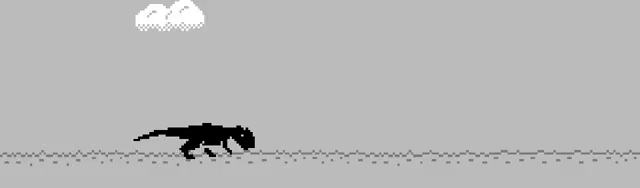

Клон игры про динозаврика... но с новыми механиками.

# Запуск

Сделать копию config-example.yml:

```shell
cp config-example.yml config.yml
```

Запустить через main.py

# Использование multitool.py для генерации новых объектов и обработчиков

## Объект

```shell
python multitool.py make:object <NAME> [OPTIONS]
```

**Аргументы**
- `<NAME>`: Название нового класса.

Название файла будет сгенерировано в snake_case из названия нового класса. Новый класс будет добавлен в `__init__.py`.

**Опции**
- `--parent <PARENTS>`: Родительский класс (или классы через запятую). По умолчанию `Object`.
- `--handler <HANDLER>`: Название класса обработчика. По умолчанию не подставляется (`None`).
- `--make-handler <PARENT_HANDLERS>`: Создать класс обработчика `КлассОбъекта + Handler`. Через запятую можно перечислить дополнительные родительские классы помимо `ObjectHandler`. 

| Переменная       | Описание                                                               |
|------------------|------------------------------------------------------------------------|
| _ParentClasses_  | Родительские классы. Если не пустой, подставляется с запятой.          |
| _NewObjectClass_ | Название нового класса.                                                |
| _HandlerName_    | Имя обработчика. Если есть, то подставляется с HANDLER_NAME: str = ... |

## Обработчик

```shell
python multitool.py make:handler <TARGET> [OPTIONS]
```

**Аргументы**
- `<TARGET>`: Класс объекта, которым управляет обработчик.

Название файла будет сгенерировано в snake_case из названия нового класса. Новый класс будет добавлен в `__init__.py`.

**Опции**
- `--parent <PARENTS>`: Родительский класс (или классы через запятую). По умолчанию `ObjectHandler`.

| Переменная        | Описание                                                                             |
|-------------------|--------------------------------------------------------------------------------------|
| _HandledObject_   | Класс объекта, которым управляет обработчик                                          |
| _NewHandlerClass_ | Название нового класса. Составляется из _TargetObject_ + Handler                     |
| _ParentImports_   | Импорты родительских классов из файлов, сгенерированных в snake_case из имён классов |
| _ParentClasses_   | Родительские классы. По умолчанию ObjectHandler, может объединяться с другими        |